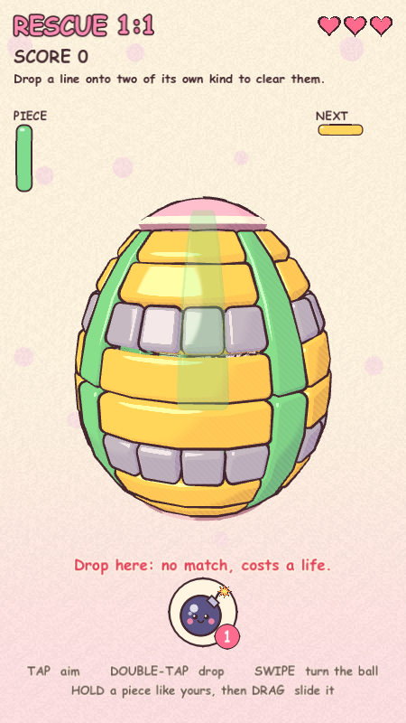
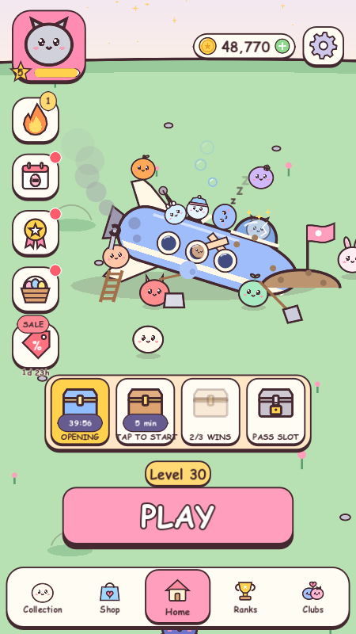

# EggBlok - Puzzle Break

 

**EggBlok - Puzzle Break** is a playable recreation of the *Tetrisphere* (N64,
1997) gameplay loop, written from scratch in Godot 4.7 / GDScript, as a
**portrait mobile game**. **No code, art, audio, or data from the ROM is used or required** — see "Provenance" below.

## Running it

Open `project.godot` in Godot 4.7 and press F5. On desktop it opens as a
450×800 portrait window, and the mouse stands in for touch. It opens on a
splash and a loading screen; a brand-new player goes straight into Level 1
with its walkthrough, and everyone after that lands on Home. Progress is
saved (encrypted) to `user://profile.cfg`; delete it to start over.

The project is set up for phones: a 720×1280 portrait viewport locked to
portrait, UI that stretches to taller screens, and the Compatibility renderer
(OpenGL ES 3), which runs on the widest range of Android and iOS devices and
looks the same on desktop.

**Android.** `export_presets.cfg` has an **Android** preset: package
`com.jvea03.tetrisphere`, version 0.2.0 (code 1), portrait, immersive, for
64- and 32-bit ARM phones, with the app icon and Android's adaptive icon from
`icons/` (drawn by `tools/make_icons.gd` from the game's own art). It needs
Godot 4.7.1's export templates, the Android SDK and JDK 17, with their paths
set in Godot's Editor Settings (Export > Android). A debug build, signed with
Godot's debug key, comes out of:

```
Godot.exe --headless --path . --export-debug "Android" build/eggblok-debug.apk
```

Copy it to a phone and open it (allow installs from unknown sources), or
with the phone plugged in and USB debugging on, `adb install -r
build/eggblok-debug.apk`. `build/` is left out of git. A Play Store
release needs your own upload key (set under the preset's release keystore)
and, for Google Play, an App Bundle (AAB) -- a Gradle build, which needs the
Android build template installed from the editor's Project menu.

**Touch controls** — everything is a gesture, apart from the three booster buttons and pause:

| Gesture | Action |
| --- | --- |
| Swipe | turn the ball (left / right all the way round, up / down to tilt) |
| Tap the ball | aim your piece so it covers the spot you tapped |
| Double-tap | drop the piece where it is aimed |
| Tap and hold, then drag | slide the held piece, one cell per ~56 px of drag, if it is legal (see Sliding); let go to put it down |
| Bomb button (bottom centre) | arm / stow a bomb: the next double-tap blasts instead of dropping. The badge counts your bombs (kept between levels); the button lights up yellow while armed and pops when you earn one. Empty, it offers an ad for one bomb or a coin buy. It appears once bombs arrive, at level 3, where a hands-on walkthrough has you arm one and set it off |
| Swap button (bottom left) | trade the piece you hold for the one with the biggest match anywhere on the egg, aimed right at it. Only a different piece counts: if no other piece can match anywhere, it says so and the Swap is kept. It appears at level 4, with 3 |
| Rocks button (bottom right) | fire two rocks at the egg: each lands on one of the biggest same-type groups showing (a pair is a match one piece short) and finishes it, as if a matching piece had joined -- grey touching it shatters, and gravity and chains follow. Ties go to the group nearest your aim. It appears at level 8, with 2 shots |
| Pause button (top right) | the pause menu: Resume, Restart Level, How to Play, Replay Walkthrough, sound and haptics toggles, Home (the ball is kept for CONTINUE) |

A touch that moves before 0.35 s is a swipe; one that stays put that long is a
hold. A hold on something you cannot slide says why, and dragging from there
turns the ball instead. The second tap of a double-tap must land within
0.35 s and 48 px of the first; it drops at the aim the first tap set.

The desktop keyboard still works: `A`/`D`/`W`/`S` or the arrow keys to aim
(the ball turns to follow), `Space` to drop, `F` to arm / stow a bomb, `G` to
Swap, `T` to fire Rocks, `R`
to restart the level, `Esc` or `P` to pause. In a debug build `F2` wins the
ball and `F3` loses it, to try the win and lose cards. With the mouse, click
is a tap, double-click drops, click-drag turns, and press-and-hold then drag
slides.

## The menus

Every menu from Duckdoku (`Documents/meow-ship`), rebuilt for Tetrisphere in
its hand-drawn style: the same screens, flow and systems, re-themed, with all
art drawn in code (`scripts/ui/icon.gd`) -- none of Duckdoku's art is copied.

| Duckdoku | Tetrisphere |
| --- | --- |
| Ducks (the collection) | **Critters** -- the little creatures sealed in the egg. The one you pick is the one in the egg, in its colour |
| Ships | **The crash site** -- a camp to build (6 spots) and then the crashed spaceship to fix (9 parts); each is upgraded after, and every step shows at Home |
| Anchors (1 per life left) | **Stars** (1 per heart left, +2 for a first try) |
| Crews / Teams | **Clubs** (Leader, Officer, Member) |
| 7 Day Quest Voyage | **7-Day Egg Hunt** |
| Sonar, Bomb, Tidal Wave boosters | the **bomb**, the **Swap** and **Rocks** -- the bundle, streak and Battle Pass rewards pay bombs |
| Daily Puzzle | **Daily Egg** -- a level picked from the date |
| Sinking ships (quests) | **Clearing pieces** |

**Screens:** splash and loading; **Home** (avatar card with collection level,
wallet, Settings, the side tiles for the login streak, Daily Egg, Battle Pass,
Egg Hunt and any running sale, the chest tray, the level plate and PLAY) with
its pop-ups -- Settings, Profile, chest opening, finish-a-chest-now, pop-up sales, leaderboard results, and
the Home and Daily Egg walkthroughs; **Battle Pass** (30 tiers of free and
premium rewards, buy a tier for coins, Daily/Weekly quests, buy-pass pop-up);
**Collection** (critters to buy and upgrade to Lv 10; the camp to build and the ship to fix, each up to Lv 4, the ship once the camp is done; titles
and stars, rarity, collection level, the first-visit walkthrough with its
coin gift); **Shop** (weekly featured sale, No Ads pass, bundles, bomb, Swap and Rocks packs,
coin packs with a free daily pack); **Leaderboard** (Daily / Weekly /
Season, pinned own row, podium prizes); **Clubs** (join, search, create with
a badge; club page with the Leader's note, chat, members and a weekly club
leaderboard); **Daily Streaks** (login and Daily Egg streaks, a coin claim
a day, bombs every 7th day); **Egg Hunt**; and in the game: pause, the win
card (coins, stars, chest progress, bonuses, Next Level), the lose card (+3
hearts for coins, an ad for +1 heart, Quit), the out-of-booster cards, and the
Level 1, sliding (level 2), bomb (level 3), Swap and Rocks walkthroughs. The bottom nav (Collection, Shop, Home,
Ranks, Clubs) slides between the tab screens.

**The crash site.** Behind all of Home is a little planet in three-quarter
view, a world about 3.6 screens wide (`scripts/ui/ship_scene.gd`). A
spaceship has crash-landed nose-first in a heap of dirt, and the critters
have made camp around it. Everything there looks however far you have got
with it in the Collection, where **the camp comes first**: its six spots --
campfire, tent, workbench, garden, well and lookout -- start as makings
(cold ashes, a torn tarp, loose planks, bare dirt, a pile of stones, a pile
of logs), are built, then upgraded three times, up to a bonfire with a
cooking pot, a cabin tent with string lights, a workbench under a striped
awning, a garden of pumpkins with a sunflower, a roofed well with flower
boxes and a flagged lookout tower. Once every camp spot is fully upgraded
(`TSProfile.CAMP_LEVEL_FOR_SHIP`), the ship's nine parts open -- engine,
hull, cockpit, antenna, fins, portholes, nose cone, landing legs and solar
panels -- broken until fixed (a smoking engine, a scorched hull, cracked
glass, a bent antenna and fin, boarded portholes, the nose buried in dirt,
a snapped leg, shattered panels), then upgraded three times, up to rainbow
thrusters, gold trim, a headlamp, a glowing orb, golden fins, curtained
windows with gold rims, a golden nose tip, sprung golden legs and
sun-tracking golden solar panels (see `TSProfile.PARTS` for every stage).
Camp spots are cheaper than ship parts. Drag any empty part of Home to look
around (it glides after a flick); the menus stay put and keep their own
touches. Every critter you own
is out there at work, the avatar first, each taking the next of 24 jobs,
spread over little neighbourhoods round the crash -- the ship itself, a pond
to the west, a camp and a stargazer to the east, a crater field to the south:
flying it (seeing stars), fixing the engine up a ladder, digging the nose
out, fishing in the crater pond, toasting a marshmallow, napping on the deck,
bouncing on the dome, peeking out of a porthole, planting a flag, flying a
kite, stargazing through a telescope, hauling a crate, painting over the
scorch marks, juggling, sweeping, chasing a glowing bug, reading the manual,
dancing by the fire, popping out of a crater, swinging from the antenna,
perching on a fin, blowing bubbles and strolling about. A lone critter just
strolls. Nearer things are drawn bigger and in front, each on a soft shadow;
tap a critter and it hops.

**Launch prep and the launch.** As the ship is fixed, the crash site turns
into a launch site. Until half its parts are fixed it lies crashed; then it
is righted, level on its legs amid wooden scaffolding and a LAUNCH PREP
sign; once every part is fixed it stands upright on a launch pad beside an
orange gantry, with a fuel tank and hose and a countdown board -- bunting
strung from the gantry when it is nearly fully upgraded, searchlights
sweeping the sky when it is. The critters that lounged on the deck move to
the gantry and the pad. In the last 3 days of each season
(`TSProfile.LAUNCH_WINDOW_DAYS`) the board flashes LAUNCH! and Home shows a
**LAUNCH!** button: the ship rumbles, then roars off on a column of smoke
with its pilot, peeker and antenna swinger aboard, and pays 5,000 coins plus
500 per ship part level (up to 23,000 fully upgraded). The critters land on
a new planet, in new colours, with a fresh camp and ship to build for the
new season; the part levels left behind are banked, so the Collection
level never drops. One launch per season.

**Progression** is Duckdoku's difficulty curve, level for level: the same
five tiers (Beginner, Intermediate, Hard, Expert, Extreme) in the same order
as its level design sheet. Levels 1-50 are fixed -- baked into
`levels/levels.json` by `tools/bake_levels.gd`, so every player gets the
same fifty balls and they never change under them -- and from 51 on each ball
is generated from its level's seed, the tiers repeating Duckdoku's 51-70
stretch every 20 levels (`TSLevels.LEVEL_PLAN`, `LEVEL_LOOP_TEMPLATE`).
Either way a level is the same ball every time it is played. Duckdoku's
board size and starting-hint columns have no Tetrisphere equivalent (the
egg is one size, and there are no hints), so only the tier carries over.
Features unlock as in Duckdoku -- bombs at level 3, the Swap at 4, Rocks at 8,
the Collection at
5, chests, the Battle Pass and the Egg Hunt at 7, the Daily Egg at 10, Clubs
at 25 -- each with its walkthrough the first time. Leaving a level mid-ball
parks it, and Home's PLAY becomes CONTINUE.

**Simulated, as in Duckdoku's desktop builds -- needed before a release:**

- **Purchases** (`scripts/meta/billing.gd`) succeed instantly. The Google Play
  Billing and StoreKit code paths are ported and switch on when those
  plugins are installed, but none of the product ids exist yet: they must be
  created in Play Console and App Store Connect under Tetrisphere's own
  listing.
- **Ads** (`scripts/meta/ads.gd`) "play" for 2.5 seconds and always reward.
  Only Google's public test ad units are in the code. Tetrisphere needs its
  own AdMob app and ad units; Duckdoku's belong to Duckdoku's listing and are
  deliberately not reused.
- **Leaderboards and Clubs** have no backend: rivals, clubs, members and chat
  replies are simulated locally and deterministically, as in Duckdoku.
- **Music**: the Settings toggle drives a "Music" audio bus, but Tetrisphere
  has no menu track yet. Sound effects are synthesized in code
  (`scripts/meta/sfx.gd`).

## The look

A cute, hand-drawn style, all in `scripts/toon.gd` (`TSToon`):

- **Cel shading in pastels.** Two hard steps of light instead of a smooth
  falloff, a soft lilac shadow side with pencil hatching, and a small hard
  shine. Deeper layers are drawn a little darker, so you can tell them apart.
- **Ink outlines** round every piece, the caps and the creature. They are
  drawn by growing each mesh along its normals, and wobble in width from place
  to place, re-drawn five times a second like a pencil line ("line boil").
- **Soft pieces.** Each cell is a rounded tile that the vertex shader bends
  onto the curved egg. Where a piece carries on into the next cell, the tile
  is left open and runs to the cell edge, so a line is one smooth bar with no
  seams, rounded and inked only round its own outline.
- **Paper background:** cream warming to pink, with faint polka dots and
  grain, on a quad behind the ball, so it stays put as the ball turns.
- **HUD** in a handwriting-style font from the device (Chalkboard on Apple,
  Comic Sans on Windows, "casual" on Android), in ink with a paper outline.
  Along the top: the level and score in the left corner, the hearts in the
  middle and the pause button on the right, all kept below the phone's safe
  area and never less than 48 px from the top, clear of a notch or
  punch-hole camera.
  It includes ink-outlined hearts, rounded piece previews (the next piece
  above the held one, which sits in a sunken tray) and three round booster
  buttons: the Swap, a bomb with a face, and a pair of smiling Rocks.
- **The creature** is a milky blob with big sparkly eyes and pink cheeks.

## The rules as implemented

- The playfield is a **shell of stacked pieces** wrapped around an **egg**:
  20 columns of longitude that wrap, 8 rows of latitude with hard rims. It
  starts smooth, three layers deep. The grid is laid out on a sphere and
  then stretched into an egg (taller, narrowing toward the top; see
  `EGG_TALL` and `EGG_TAPER` in `board_view.gd`), so the rules never see the
  shape. The poles beyond the last rows hold no cells; **caps** close them
  over (a pink dome with a cream trim ring, and a wall under the trim down
  to the core), so the egg looks whole and you cannot see in through the
  top or bottom. They are scenery only: not part of the board, and taps on
  them do nothing. A wide-eyed creature is sealed in the core, and it is the
  one you are rescuing.
- **Pieces never rotate.** An orientation *is* a piece: the flat line and the
  upright line are two different pieces, in two different colours, and they
  do not match each other. Each piece is drawn as one soft, rounded bar with
  an ink outline round only its own silhouette, so you can always see which
  blocks belong together.
- **Level 1 (`RESCUE 1:1`)** uses only three pieces: **flat lines** (yellow),
  **upright lines** (green) and small grey **blocker squares** (about a quarter of the
  surface you see — see "The pattern generator" below). You are only ever
  dealt pieces; blockers exist only in the shell. Level 1's egg is also only
  **two layers** deep (every other egg is three): the line pattern on top
  and a searched layer under it, so the critter is never far below -- a
  gentle first ball (the casual sim bot wins it every time, up from 67% on
  a three-layer egg). The level rules carry the depth as `shell_depth`, and
  the pole caps follow it.
- **New pieces join by tier.** Beginner levels are the two lines.
  **Intermediate adds the 2x2 O square** (sky blue). **Hard mixes any three**
  of five pieces -- the two lines, the square, the **plus** (strawberry pink,
  five blocks) and a **capital-L** piece (lilac: an upright stem of three
  with a foot to the right at the bottom) -- and **Expert and Extreme any
  four**, each level taking the next combination in turn (`TSLevels.tier_mix`)
  so no two in a row match.
  Every piece a level deals is also tiled into its shell,
  so each has somewhere to match from the first drop. The plus is not a
  Tetris piece; like every piece here it never rotates. Two early levels
  preview the new shapes with their own pairs (`TSLevels.LEVEL_PIECES`):
  **level 3 is only squares and upright lines**, and **level 4 only flat
  lines and pluses** (the casual sim bot wins them 100% and 75%). From level
  9 on, a Beginner level is **any two of the four pieces**, taking the next
  of the six pairs in turn (`TSLevels.BEGINNER_PAIRS`) so no two in a row
  match: level 9 flat + square, 10 upright + plus, 12 the two lines, 13
  square + plus, 50 upright + square. Pairs with the plus leave more grey
  (about 40-45% of the surface), and all of them stay easy (100% for the
  casual sim bot).
- **The early lessons.** Level 1 walks through the egg, the gestures and the
  hearts. **Level 2 teaches sliding** hands-on: the egg turns to a flat line
  that can slide, and the walkthrough waits until you hold it and drag it.
  **Level 3 teaches the bomb** the same way: bombs arrive there (three to
  start, and none can be earned before), and the walkthrough waits for you
  to arm one and then double-tap the egg to set it off.
- Every piece lies **flat in one depth layer**. Your piece is aimed as a
  translucent **footprint on the shell** and **drops straight in**, resting on
  the highest block beneath it and bridging any lower holes.
- **Matching:** when a drop makes **three or more orthogonally connected pieces
  of the same type** touch, **the entire connected group is destroyed** —
  including pieces the drop never touched, if they connect through the group.
  "Orthogonally connected" means sharing a face: side by side in a layer, or
  stacked directly above or below, which is how a piece dropped onto its own
  kind joins it. **Blockers touching a destroyed piece shatter too.**
- **Armoured blockers** (dark steel) have a second layer. A hit -- a match
  beside one, a bomb, a rock -- knocks the armour off and leaves a plain grey
  blocker, which the next hit breaks. Sliding into armour does nothing: it
  stops the slide like any other piece. Armour is also the main difficulty
  lever: none in Beginner, then 50% of the blockers in Intermediate, 35% in
  Hard, 30% in Expert and 22% in Extreme (`TSLevels.ARMOR_SHARE`), tuned so
  the casual sim bot's journey averages come out Beginner 95%, Intermediate
  52%, Hard 33%, Expert 19% and Extreme 10%.
- Destroying pieces **exposes the layer underneath**.
- **Gravity:** a piece with nothing beneath any of its blocks **falls to the
  next lower depth layer**, as one rigid piece, until something holds it. A
  line with even one block still supported stays put.
- **Chain reactions:** once gravity settles, matches are checked again among
  the pieces that fell, and **new matches explode automatically**, which can
  drop more pieces, and so on.
- **A drop that makes no match costs a life.** You have three (the hearts
  at the top centre); losing the last ends the board. The aim outline is
  bright where a drop will match and dim where it will not (there is no
  text readout: the glow says it). Bombs do not cost lives.
- **The fair deal:** if the piece coming up has nowhere on the ball to make a
  match but another of the level's pieces does, you get that one, with a message. A
  forced miss would otherwise cost a life no matter how you play.
- **Sliding moves pieces already on the ball — only ones like the piece you
  are about to drop.** Holding a flat line, you can slide flat lines;
  holding an upright, uprights. Tap and hold such a piece to grab it (it
  glows; your own piece is put away), then drag to push it one cell at a
  time, within its own layer; the drag direction is matched to the ball's
  directions as you see them on screen. **Grey blockers in its way are smashed;
  any other Tetris piece stops it dead.** Blockers themselves cannot be slid.
  **A slide only moves pieces: it never triggers a match.** If it leaves a
  piece hanging over a hole, that piece falls, but even three same-type
  pieces slid together just sit there until a drop joins them. So sliding is
  for setting up a drop — e.g. on a fresh Level 1 ball, slide a flat line
  into the grey row beside it (smashing the four grey squares) so it lies
  against the flats beyond, then drop a flat line onto them. A slide is not
  a drop, so it never costs a life.
- Scoring: each link of a chain multiplies the points. A **chain reaction, or
  5+ pieces destroyed at once, earns a bomb**, which destroys every piece
  showing within 2 cells of where it lands -- **whole pieces**, never part
  of one, so no line is left as a stub -- shatters the grey touching them,
  and lets gravity and chains follow.
- Clears play like the footage: the blocks flash white, tumble off the ball
  in their own colour, and the score floats up. Down the left, the next piece
  sits above the piece you hold, which rests in a tray. After each drop the
  next piece falls into the tray, lands with a squash and a little hop (the
  tray dips under it), and the new next piece drops into its slot from above.
  A Swap pops its new piece into the tray. The next piece waits on a
  slimmer tray of its own. Tips and events ("Chain x2!", "Bomb armed")
  show as a short toast beside the pieces and then fade, so there is no
  standing line of text over the egg.
- Readability pass: muted text is darker for contrast, and locked
  collectibles show as soft grey shapes with a small lock instead of black
  silhouettes. The chest band reads UNLOCK, and the LAUNCH PREP sign hangs
  on the scaffold where the Home buttons can't cover it.
- **Win when the creature can escape:** dig one hole big enough for it — a
  square of cells dug all the way down to the core, with nothing left in
  them. A long thin trench is not wide enough, and a piece lying across the
  top of a pit still blocks the way out. There is no progress readout; you
  see the creature once you dig down to it. When the hole is open, the
  creature shrinks, flies out through it, and the win card appears.
- **Difficulty has three levers**, set together per difficulty in
  `TSLevels.DIFFICULTIES`:
  - *The pieces.* The more kinds of piece in play, the fewer places each one
    has to match, and the plus is awkward to place.
  - *The creature's size.* The bigger it is, the bigger the hole it needs,
    and it is drawn at that size, so you can see it once you dig down to it.
  - *The deal.* Each piece dealt is the one **most common on the board**
    (counting every piece, buried ones included) with a set chance, and one
    of the others, evenly, otherwise. An even deal is 1 in however many
    pieces the level has (50% for two, 33% for three, 25% for four); more
    than that mostly hands you the piece with the most places to match. A
    tie for most common deals evenly. The NEXT piece is dealt a drop ahead,
    from the ball as it stood then, and the fair deal still applies on top.

  | Tier (Duckdoku's five) | Pieces | Hole needed | Common piece dealt |
  | --- | --- | --- | --- |
  | `BEGINNER` | flat, upright | 2x2 | 80% |
  | `INTERMEDIATE` | + O square | 3x3 | 65% |
  | `HARD` | any 3 of lines, square, plus, L | 4x4 | 50% |
  | `EXPERT` | any 4 of lines, square, plus, L | 2x2 | 85% |
  | `EXTREME` | any 4 of lines, square, plus, L | 4x4 | 85% |

  The plus costs so much that Expert and Extreme give some back through the
  other two levers -- a smaller critter and a kinder deal than before it
  arrived (they were 4x4 / 35% and 5x5 / 25% with lines only) -- so the
  win rates still follow Duckdoku's curve (see "Checking it").
  Each level's tier comes from Duckdoku's curve (see "The menus" above);
  Home flags an Extreme level on the level plate, and Extreme pays double.
- **Lose** by running out of lives -- the lose card offers 3 more hearts for
  coins or 1 for an ad -- or by piling any cell past 9 blocks and overloading
  it, which can only be retried.

A tier's pieces are set in `TSLevels.DIFFICULTIES`; `TSLevels.rules_for_tier`
builds the level's full rules from them and the shared entry in
`scripts/levels.gd`: the largest same-type group a fresh ball may hold
(`seed_group_max`), a blocker cap (`blocker_cap`), how often the generator
reaches for a blocker (`blocker_share`), how hard it keeps types apart
(`mix`), and whether the fair deal applies. Any shape in `TSBoard.SHAPES`
can go in a tier (I flat, I upright, O, T, S, Z, J, L, plus); give a new one
a colour in `TSBoardView.TYPE_COLORS`. Levels 1-50 are baked, so re-run
`tools/bake_levels.gd` after changing a tier's pieces or the generator.
Shells built without blockers are not ready yet: without a blocker to fill
awkward gaps, the generator often cannot finish a layer and falls back to a
plain tiling.

### The pattern generator

With **whole-group matching** and **only two line types**, a fresh ball must
not already contain three connected same-type lines, otherwise the first
drop nearby destroys a group the player never built. But lines are 4 long,
the ball is 3 layers deep, and any two same-direction lines that sit end to
end, side by side or stacked touch. Keeping them apart takes blockers, and
the general search generator needed about 40% grey to manage it:

| Setting (search generator) | Grey at start | Drops per board (bot) | Biggest single drop |
| --- | --- | --- | --- |
| No ready-made matches | ~40% | ~7 | 27 pieces |
| Ready-made groups up to 3 allowed | ~37% | ~6 | 31 pieces |
| Ready-made groups up to 4 allowed | ~32% | ~4 | 54 pieces |
| No ready-made matches, 2 layers deep | ~41% | ~6 | 21 pieces |
| No ready-made matches, 1 layer deep | ~31% | ~5 | 6 pieces |

So the Beginner levels use a **pattern generator** (`"generator": "pattern"`
in `levels.gd`) instead. Each pattern layer is four 5-column units round the
ring, each a 4-wide stack of flat lines with an upright line beside it in
each 4-row half. The plain unit:

```
row 7   F F F F U    top half      flat pair
row 6   F F F F U
row 5   . . . . U                  grey row
row 4   F F F F U                  flat pair
row 3   F F F F U    bottom half
row 2   . . . . U                  grey row
row 1   F F F F U                  flat pair
row 0   F F F F U
```

Every same-type group is at most a pair, so nothing is ready-made, with only
2 rows in 8 grey. But that is the *only* way to stack six flat rows in eight
with no run of three, so a ball made of plain units always looked the same,
just turned -- the first eleven Beginner levels were one ball. So **two or
three units in each layer are varied**: they take a third grey row, laid out
any of the 16 ways that still keep flat runs to two, e.g.

```
row 7   . . . . U
row 6   F F F F U
row 5   F F F F U
row 4   . . . . U
row 3   F F F F U
row 2   F F F F U
row 1   . . . . U
row 0   F F F F U
```

The unit the ball opens facing is always a varied one, so a level shows what
sets it apart before you turn it -- every level, level 1 included. That puts
the surface at **25-27.5% grey** (20% for a plain unit, 30% for a varied one). Two pattern layers cannot sit
directly on each other (their flat rows would stack), so the pattern lays
out the **surface** and the **bottom** layer, and the search fills the
hidden middle layer around both. Each ball also picks a random offset
around the ring. The two halves always line up, so every upright pairs with
the one across the middle; that pair is what gives a dropped upright
somewhere to match on a fresh ball. (Nudging the halves apart left no upright
match anywhere, so uprights were never dealt.)

Result: **25-27.5% grey on the surface** (search alone was ~40%), never a
ready-made match, generated instantly. The rules test checks the same over
50 balls. The baker compares levels by their surface, however turned, so no
two of levels 1-50 look alike, and the meta test checks it.

### Balls with the O and the plus

The pattern only knows the two lines, so tiers with the O square or the plus
tile every layer with the search generator. The new shapes are what lines
lacked: the O plugs 2x2 pockets and the plus fits round corners, so the
search now leaves only about as much grey as the pattern -- **about 20-30% of
the surface** (the rules test allows at most 35% over 30 balls per tier) --
in roughly 60 ms a ball, quick enough for the generated levels after 50.
These tiers also let same types sit side by side (`mix` of -1; groups still
never pass a pair), because three or four piece types spread the match spots
thin, and a ball kept fully apart left the casual bot too few to aim at.

## Reference notes

Checked against a still from Rescue 1:1 and a 35-second gameplay clip,
stepped through frame by frame.

**Confirmed, and now matched:**

- Every level opens as a smooth, even ball of flat, tightly tiled slabs.
- The piece is aimed as an outline lying on the surface and drops straight in
  at that spot; there is no hovering piece.
- The camera turns the ball to keep the aim in front of you.
- A wide-eyed creature is sealed in the core; a magenta tunnel sits behind.
- The shell is made of whole pieces, and a match is made of pieces, not
  individual squares. Pieces do not rotate; each orientation is its own piece.
- Clears flash white, then shatter into tumbling tiles, with a floating score.
- The held and next pieces sit down the left; `RESCUE 1:1` sits in the corner,
  with three lives beneath it.

**Confirmed by you (not visible in the clip):**

- Pieces never rotate; the flat and upright line are separate pieces.
- Level 1 is flat lines, upright lines and grey blockers, mostly lines.
- Sliding moves a piece that is already on the ball, and only one like the
  piece you are about to drop. It only moves pieces; it never triggers a
  match. Blockers break when a combo takes out a piece touching them, or when
  you slide a piece into them. Sliding cannot break Tetris pieces.
- A drop that fails to make a combo costs a life.
- Matching destroys the whole orthogonally connected same-type group; pieces
  that lose their support fall a layer; matches made by falling pieces
  explode automatically, as chain reactions.
- The level is won when one hole is big enough for the creature in the
  middle to escape, and the creature's size is a difficulty lever (easy,
  medium, hard, extreme).
- The chance of being dealt the piece most common on the ball is a
  difficulty lever too.

**Seen, not yet built:**

- The burst of light rays on big combos.
- A per-level palette (navy with gold, navy with green) and different cores.
- The score multiplier badge (the multiplier exists; only the badge is missing).

**Still guessed:**

- *Pieces as rigid, one-layer plates.* A piece falls only when none of its
  blocks is supported, and a dropped piece lands flat on the highest block
  beneath it. That reading of "falls toward the next lower depth layer" is
  mine.
- *What "big enough" means.* A square hole dug to the core, 2x2 / 3x3 / 4x4 /
  5x5 cells for easy to extreme, is my reading; so are the creature's drawn
  sizes and the escape animation.
- *Slide details.* One cell per drag step, within the piece's own layer, is a
  design guess, as are the gesture timings. So is "like the piece you are about to drop"
  meaning the piece you hold (the PIECE preview), not the NEXT one after it,
  and a slid piece falling if it ends up over a hole. The aim brightness cue
  and the fair deal are guesses too.
- *Which orientations the other pieces come in.* Only the line is confirmed
  in both; the rest currently exist in their usual Tetris resting pose.

## Layout

| File | Role |
| --- | --- |
| `scripts/levels.gd` | Level definitions (which pieces each level uses, blockers, shape mixing, fair deal) and the difficulty presets (hole size, deal bias). |
| `scripts/board.gd` | Rules only: the pieces on the grid, dropping, sliding, matching, gravity, chain reactions, blockers, and the pattern and search generators. No rendering, no input. |
| `scripts/toon.gd` | The hand-drawn look: cel-shading, ink-outline and paper shaders, the rounded tile meshes (and the shader that bends them onto the egg), and the font. |
| `scripts/board_view.gd` | Maps the grid onto the egg, draws each piece as one rounded bar and the pole caps, and plays the clear effects. |
| `scripts/game.gd` | The game screen: builds the scene in code, drives input, camera and HUD, levels, and the pause, win, lose and ad cards. |
| `scripts/meta/profile.gd` | `TSProfile`: the saved player -- coins, boosters, critters and ship parts, clubs, streaks, simulated leaderboards, Battle Pass and quests. |
| `scripts/meta/chests.gd`, `hunt.gd`, `sales.gd` | The chest tray, the Egg Hunt, and pop-up sales. |
| `scripts/meta/nav.gd`, `tunables.gd`, `session.gd`, `filter.gd`, `haptics.gd`, `sfx.gd` | Unlock levels, live-tunable numbers, the parked ball, the name/chat filter, vibration, and synthesized sounds. |
| `scripts/meta/scene_flow.gd`, `ads.gd`, `billing.gd` | Autoloads: fade and slide transitions (and the Android back button), the ad service, the purchase service. |
| `scripts/ui/kit.gd`, `icon.gd`, `fx.gd`, `coin_pill.gd`, `tutorial.gd`, `screen.gd`, `ship_scene.gd` | The menus' hand-drawn widgets, every drawn icon, the coin shower and confetti, the wallet, the spotlight walkthrough, and the base for every screen with its nav bar. |
| `scripts/screens/*.gd`, `scenes/*.tscn` | One script and scene per menu screen. |
| `tests/sim.gd` | Headless balance check: win rates per tier, and across the level journey (1-70), for a careful and a casual bot. |
| `tools/bake_levels.gd`, `levels/levels.json` | Bakes levels 1-50 into the level bank, as Duckdoku does. |
| `tests/rules_test.gd` | Hand-built positions pinning down slides, spreading matches (lines, the O and the plus), gravity, chain reactions and the aim preview; plus generated balls for Beginner (pattern) and Intermediate and Expert (search) checked for ready-made matches, grey share, gaps and match spots. |
| `tests/tap_test.tscn` | Taps projected cells on the real rendered ball and checks the piece lands over them; then plays the gestures (swipe, tap, double-tap, hold and drag) through the touch handler, and checks the egg mapping and the bomb button. |
| `tests/demo.tscn` | Visual QA — boots the real game and plays a greedy opening. |
| `tests/meta_test.gd` | The menus' systems on a throwaway profile: stars and coins, chests, the Battle Pass, quests, streaks, the collection, clubs, the Egg Hunt, purchases, sales, level progression. |
| `tests/flow_test.tscn` | The game screen's side of them: level start, parking and resuming a ball, the Swap and Rocks, booster buys, the lose card's refill, a win's payout, the Daily Egg. |
| `tests/menu_capture.tscn`, `tests/card_capture.tscn` | Visual QA -- open any menu screen, or the pause / win / lose / out-of-booster card, on a throwaway profile with everything unlocked. |

## Checking it

Plays the five tiers and the level journey headless and reports win rates:

```
Godot.exe --headless --path . --script res://tests/sim.gd
```

And the rules test, which exits non-zero on any failure (89 checks, all
passing):

```
Godot.exe --headless --path . --script res://tests/rules_test.gd
```

And the tap and gesture test (30 checks, all passing). It needs a real window because it
projects cells through the rendered camera:

```
Godot.exe --path . res://tests/tap_test.tscn
```

The menus' systems (88 checks) and the game screen's flow through them (28
checks), all passing. Neither touches the real save:

```
Godot.exe --headless --path . --script res://tests/meta_test.gd
Godot.exe --path . res://tests/flow_test.tscn
```

To look at a menu screen without playing up to it (`home`, `battle_pass`,
`collection`, `shop`, `leaderboard`, `clubs`, `clubs_in`, `streak`, `hunt`,
`game`, optionally with a level: `game 22`; `home all` owns every critter),
or at an in-game card (`pause`,
`win`, `lose`, or an empty booster: `bomb`, `swap`, `rocks`):

```
Godot.exe --path . res://tests/menu_capture.tscn -- collection
Godot.exe --path . res://tests/card_capture.tscn -- win
```

The sim plays by the same hearts, deal, fair-deal, gravity, chain and escape
rules as the game (a loss is three misses, with no paid rescue), with two
bots that favour moves opening up an escape-sized patch: a **careful** one
that looks at 40 spots a drop, and a **casual** one that looks at 8, like a
player who does not study the aim's glow. It takes about two minutes.

**The tiers**, 40 generated balls each:

| Tier | Pieces | Hole | Common piece dealt | Careful bot won | Casual bot won | Casual: hearts lost a ball |
| --- | --- | --- | --- | --- | --- | --- |
| Beginner | lines | 2x2 | 80% | 100% | 85% | 1.0 |
| Intermediate | + O | 3x3 | 65% | 100% | 75% | 1.4 |
| Hard | + O | 4x4 | 50% | 100% | 50% | 1.9 |
| Expert | + O, plus | 3x3 | 85% | 93% | 30% | 2.5 |
| Extreme | + O, plus | 4x4 | 85% | 93% | 10% | 2.8 |

Before the O and the plus (lines only, Expert 4x4 / 35% and Extreme 5x5 /
25%) the casual bot won 93 / 75 / 57 / 33 / 15%. With the new pieces and the
old settings it fell to 93 / 48 / 38 / 3 / 3%, so the search tiers now let
same types sit together and Expert and Extreme trade critter size and deal
for the plus, which brings the curve back.

**The journey**, levels 1-70 (the baked 1-50 and the generated loop), the
casual bot playing each level's own ball 12 times. The shape is Duckdoku's:
long easy stretches, a dip on every Hard level, and spikes on the Expert
(22, 30, 40, 54, 60, 67) and Extreme (25, 37, 46, 56, 61, 70) levels, with
an easy breather after each.

| Tier | Levels | Average casual win rate |
| --- | --- | --- |
| Beginner | 11 | 94% |
| Intermediate | 28 | 72% |
| Hard | 19 | 53% |
| Expert | 6 | 25% |
| Extreme | 6 | 25% |

Expert and Extreme have only six levels each here, so their journey averages
are noisy (level by level they range from 0% to 50%); the tier table, over 40
balls, is the steadier read, and it keeps Extreme below Expert.

Real players have more help than the casual bot -- boosters, the ad heart and
the coin refill on the lose card -- so they will win more than it does. The
tiers are tuned for the curve's shape; Duckdoku's own measured win rates are
not recorded in its project, so if its analytics has them, the tier numbers
in `TSLevels.DIFFICULTIES` are the place to match them.

## What this is not

Faithful in mechanics, not in content. There are no original sprites, models,
music (Neil Voss's soundtrack is a big part of the real thing), or alternate
shapes and modes; the menus and level progression are Duckdoku's, re-themed,
not the original game's. Block shapes, the exact drop and
match rules, and all tuning are my reconstruction of how the game plays, not a
disassembly of how it actually worked — expect differences in the details.

## Provenance

Built entirely from original code and Godot primitive meshes. Nothing was
extracted from the cartridge, and the ROM is not needed to build or run this.

For the record, extraction was investigated and is impractical: the USA ROM
(`TETRISPHERE`, cart id `NTPE`, 8 MB, CRC1 `3C1FDABE`) holds **no** recognised
compression container (no MIO0/Yay0/gzip/zlib), and **zero** printable strings
— no filenames, no symbols, no debug text. Entropy over 512 blocks of 16 KB
puts 324 of them above 7 bits, including an unbroken ~2.5 MB run from
`0x480000` to `0x700000`. That is a custom packer with no header magic, so
reaching the assets means reverse-engineering the decompressor out of MIPS
machine code first. That is a multi-week disassembly project, and the assets it
produced would be copyrighted anyway.

Game *mechanics* are not copyrightable, which is why this recreation is fine to
write and share. The ROM's art, music, and character designs are — so if this
ever goes anywhere public, it needs to keep using original assets.
